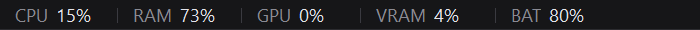

# PerfRail – Lightweight Windows 11 CPU, GPU & RAM Hardware Monitor

A thin, quiet strip along the top of your screen showing CPU, RAM, GPU, video memory and
battery at a glance. PerfRail reserves its own sliver of screen edge instead of floating on top
of your applications, so nothing it shows ever costs you a pixel of something else.



> **Status: working, not yet released.** CPU, RAM, GPU, VRAM and battery all work and are
> verified against independent sources on every change. There is no packaged download yet — build
> it yourself with the instructions below.

## It is an AppBar, not a taskbar mod

Most tools in this space either inject into Explorer or paint an always-on-top overlay
across your desktop. PerfRail does neither. It registers with Windows as an **AppBar** —
the same documented `SHAppBarMessage` API the taskbar itself uses — and asks the shell to
reserve 20 device-independent pixels for it.

The practical difference: maximized windows stop *below* PerfRail instead of *behind* it.
The desktop work area genuinely shrinks, so nothing is covered and no clicks are
intercepted. If you close PerfRail, the space comes straight back.

PerfRail:

- does **not** inject into `explorer.exe`
- does **not** modify or replace the Windows taskbar
- does **not** use Electron, WebView, or a bundled browser
- does **not** install a kernel driver
- does **not** require administrator privileges
- makes **no** network connections of any kind

## What it measures, and how

Every reading comes from an API that works for a standard user with no driver installed.

| Metric | Source | Availability |
|---|---|---|
| CPU | `GetSystemTimes` - two syscalls, differenced across the interval | always |
| RAM | `GlobalMemoryStatusEx` - physical memory in use, not commit charge | always |
| GPU | `\GPU Engine(*)\Utilization Percentage`, the counters Task Manager uses | any WDDM adapter |
| VRAM | `\GPU Adapter Memory(...)` for usage, DXGI for the capacity to divide by | any WDDM adapter |
| GPU temperature | `nvml.dll` (NVIDIA) or `atiadlxx.dll` (AMD), loaded dynamically | NVIDIA and AMD |
| Battery | `GetSystemPowerStatus` | laptops |

GPU utilisation is aggregated the way Task Manager does it: each engine's instances are
summed across processes, then the **busiest engine** wins. Summing every engine instead
reads about 19% on a completely idle machine.

On integrated graphics, where there is no dedicated video memory, PerfRail reports the
shared pool instead — otherwise the number would sit at zero forever.

## About temperatures

**GPU temperature works, on NVIDIA and AMD.** There is no OS-level API for it, but each
vendor's driver ships a user-mode library that reports it without elevation - the same
reason `nvidia-smi` runs from an ordinary command prompt. PerfRail loads `nvml.dll` or
`atiadlxx.dll` dynamically and reports nothing at all when neither is present. Intel is
not covered: IGCL only supports Arc and Alder Lake-P or newer, and integrated Intel
graphics expose no die temperature at all.

**CPU temperature is not supported, and will not be.** It comes from model-specific
registers that only ring-0 code can read, which means a signed kernel driver, which means
administrator rights to install and to run. Supporting it would mean asking you to install
a driver and then run an always-on desktop bar as administrator, which is a poor trade for
one number.

That was measured rather than assumed. Running the usual library for this
(LibreHardwareMonitorLib 0.9.7) as a standard user, every one of the eleven CPU temperature
sensors is enumerated by name and returns **null** - and CPU package power returns a
confident **0.00 W**, which is worse. That is exactly the trap PerfRail avoids: a metric it
cannot read is dropped from the rail entirely, never rendered as `N/A` holding a slot open
and never as a plausible-looking zero.

## Using it

The tray icon is the only control surface; the rail itself is passive and never takes
focus. Right-click the tray icon for:

- **Show rail** — docks and undocks. Off until you ask for it, because reserving work
  area changes the size of every maximized window on the machine.
- **Pause monitoring** — stops sampling without releasing the reserved band.
- **Settings** — update interval, which metrics to show, start with Windows.
- **Exit**

Settings live in `%LOCALAPPDATA%\PerfRail\settings.json`. A malformed file is moved aside
as `settings.json.corrupt` and replaced with defaults rather than stopping the app.

Diagnostic logging goes to `%LOCALAPPDATA%\PerfRail\logs`, capped at two files. Nothing
is written per sample — only startup, docking, shutdown and failures. A full session is
typically four lines.

### Command line

| Flag | Effect |
|---|---|
| `--dock` | Dock the rail immediately, without changing your saved preference |
| `--settings` | Open the settings window on launch |
| `--quit` | Ask a running instance to shut down through the normal path |
| `--sample [n]` | Print `n` readings as TSV and exit. No window, no AppBar |
| `--gpu-info` | List the adapters, which one is selected, and what the vendor temperature libraries report |
| `--startup-status` | Report what Windows actually thinks the startup state is |
| `--startup-enable` / `--startup-disable` | Change it |

PerfRail is a GUI-subsystem executable, so PowerShell's `&` operator cannot capture its
output. Redirect to a file or run it through `cmd /c` instead.

## Building

Requires the [.NET 10 SDK](https://dotnet.microsoft.com/download). No Visual Studio
needed.

```bash
dotnet build -c Release
```

For a standalone release build — one file, no prerequisites for the person running it:

```bash
dotnet publish src/PerfRail/PerfRail.csproj -c Release -p:StandaloneRelease=true -o out/standalone
```

That produces a ~128 MB executable. WinForms cannot be trimmed (it depends on built-in COM
marshalling, and the SDK blocks trimming for it), so the size is what it is. Its **first**
launch takes around 18 seconds while it unpacks itself; every launch after that is about
half a second.

## Verifying it

The `tools/` scripts check behaviour against the operating system rather than against
PerfRail's own opinion of itself, because most of the ways this app can break are
invisible on screen.

```bash
pwsh -File tools/verify-appbar.ps1
```

Reservation size, window styles, focus retention, idle CPU, and — reading the actual
screen pixels — that every row of the rail is really drawn by PerfRail.

```bash
pwsh -File tools/verify-telemetry.ps1
```

CPU against `\Processor Information(_Total)\% Processor Time`, RAM against
`Win32_OperatingSystem`, both at idle and under load.

```bash
pwsh -File tools/verify-gpu.ps1
```

GPU utilisation against an independent recomputation of the same counters, VRAM against
the adapter memory counters, and adapter selection.

```bash
pwsh -File tools/verify-settings.ps1
pwsh -File tools/verify-explorer-restart.ps1
```

Persistence, corruption recovery, single-instance behaviour; and that the rail
re-reserves its band after `explorer.exe` is killed. The Explorer test is disruptive — it
closes your File Explorer windows for a few seconds.

## Performance

PerfRail exists to watch your system's performance, so it must not waste it. Measured on
an i5-8265U (8 logical processors) with the rail docked at 150% display scaling:

| Configuration | CPU | Memory |
|---|---|---|
| Sampling only, no window | 0.098% | — |
| Tray icon only, undocked | 0.078% | — |
| Docked, everything running | **0.283%** | 21.9 MB private bytes |

One sample per second, no disk writes during normal monitoring, no network traffic. Most
of the remaining cost is the once-per-second repaint rather than the sampling.

The rail only repaints when a displayed value actually changes, and the AppBar only
repositions when the shell approves a different rectangle — an idle desktop produces zero
repositions.

## Design notes

A few decisions that are easy to get wrong, recorded because the reasoning is not obvious:

**The rail is topmost.** Reserving work area keeps other windows' client areas off the
band, but not their DWM extended frames — a maximized window's rect starts about 11 px
above its visible edge at 150% scaling, and its drop shadow lands on the rail. Measured,
that darkened the bottom third of the bar and cut through the text, while every Win32 API
still reported a perfectly correct window being painted in full.

**So it watches for full-screen apps.** Being topmost would otherwise mean drawing over
games. `ABN_FULLSCREENAPP` only fires for exclusive fullscreen, and modern games are
overwhelmingly borderless windowed, which sends nothing at all — so PerfRail also hooks
foreground and window-move events and drops behind any window that covers a whole monitor.

**It never takes focus.** `WS_EX_NOACTIVATE`, `WS_EX_TOOLWINDOW`, no taskbar button, no
Alt+Tab entry, and `MA_NOACTIVATE` on mouse activation. Clicking the rail leaves your
caret exactly where it was.

**It always releases the band.** Failing to call `ABM_REMOVE` leaves the desktop
permanently short until Explorer restarts, so shutdown is a single idempotent path wired
to every route out of the process, including session end.

## Requirements

- Windows 11, x64
- No administrator privileges

## License

[MIT](LICENSE)
